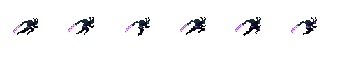
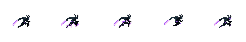
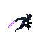
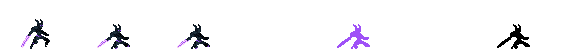
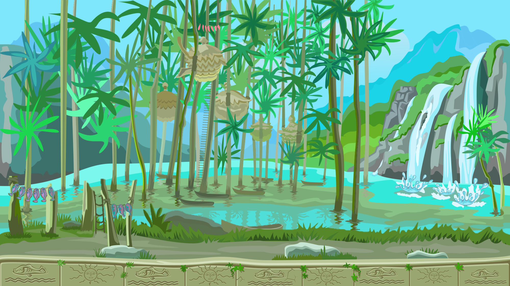

# Dark Escape

<hr>
<details>
<summary>Table of content</summary>

- [Dark Escape](#dark-escape)
  - [Overview](#overview)
  - [Gameplay](#gameplay)
  - [Assets](#assets)
    - [Main character](#main-character)
      - [Running animation](#running-animation)
        - [Sprites](#sprites)
        - [Gif](#gif)
      - [Jumping animation](#jumping-animation)
        - [Sprites](#sprites-1)
        - [Gif](#gif-1)
      - [Dying animation](#dying-animation)
        - [Sprites](#sprites-2)
        - [Gif](#gif-2)
    - [Backgrounds](#backgrounds)
      - [Tropical cliffs](#tropical-cliffs)
      - [Fairies forest](#fairies-forest)
      - [Deadly Ice](#deadly-ice)
      - [Decaying forest](#decaying-forest)
  - [Code Structure](#code-structure)
    - [Classes](#classes)
      - [Characters](#characters)
        - [The Dark runner](#the-dark-runner)
        - [Obstacle](#obstacle)
    - [Team](#team)

</details>

<hr>

## Overview

Dark Escape is a side-scrolling video game inspired by Jetpack Joyride created by a team of 5 students in class as an exercise to learn how to use the library SFML.

## Gameplay

The gameplay of our game is fairly simple:

Firstly the background is always moving from right to left, it never ends and each step performed by the player adds points to the score, which can be seen after the death of the character.

Secondly, there are only two actions allowed by the player:
- By pressing Z or ↑ (up arrow), the character goes up until it reaches the top of the screen. 
- By pressing S or ↓ (down arrow), the character goes down until it hits the ground.
  
Thirdly, during the player's journey, some obstacles or enemies may appear on the screen. If the player does not avoid them and touch them, the player dies.

Finally, the ultimate goal of our players is to go the farthest possible.

## Assets

### Main character

The main character is the Dark Runner, it possesses few sprites as we only see it running or dying.

#### Running animation

##### Sprites

##### Gif


#### Jumping animation

##### Sprites

##### Gif


#### Dying animation

##### Sprites

##### Gif


### Backgrounds

#### Tropical cliffs


#### Fairies forest


#### Deadly Ice


#### Decaying forest


## Code Structure

In every case, we assume the library SFML is loaded higher in the code.

### Classes

The code contains a few classes which are:


#### Characters

Firstly we have the character class, which manages every character displayed on screen. It contains the sprite and texture of the character (the appearance) and the position of the character. It also contains the functions to draw the sprite, to load the texture and finally to delete the character from the screen.

```cpp
class Character{
  public:
    sf::Texture texture;
    sf::Sprite sprite;
    float Xpos;
    float Ypos;

    void DrawSprite();
    void LoadTexture();
    void Erase();
};
 ```
##### The Dark runner

  Then we have the Dark Runner, the main character, it is a subclass of "Character", so it contains all previous variables and functions. The Runner also contains the user's score and a function to erase the scene and all characters on the screen and to display the score.

```cpp
class Runner : Character{
  int Score;

  void EndGame();
};
 ```

##### Obstacle

The last characters are the obstacles, it may be an enemy or a physical obstacle such as a block. As the "Runner", it is a derived class from the "Character" class. It contains a boolean to kill the "Runner" on collision or not.

```cpp
class Obstacle : Character{
  bool KillOnCollision;
};
 ```

### Team

| **Photo**                                                                                 | **Name**           |
| ----------------------------------------------------------------------------------------- | ------------------ |
|      | BISTREL Vivien     |
|     | CLEMENT Quentin    |
|      | DE KEYN Benoit     |
|  | FERNANDEZ Aurélien |
|    | CUREL Clémentine   |